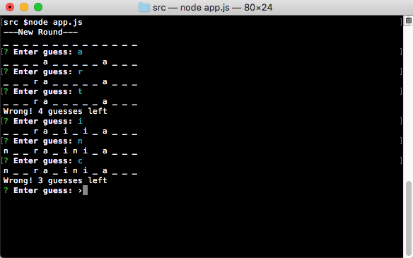

# hangman-command-line

This is a command line implementation of classic Hangman utilizing Node.js. The words are generated using the [random-word NPM package](https://www.npmjs.com/package/random-word), and the user interface utilizes the [inquirer NPM package](https://www.npmjs.com/package/inquirer).



# Usage

This application can be executed by running the app.js file with
```
node app.js
```
A new round will automatically begin, and will continue until out of guesses or you get the word correct.